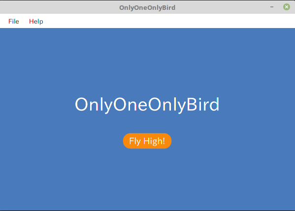

# OnlyOneOnlyBird
* Kotlin実装のルーレットアプリ
* 設定された名称のリストから１名を抽選できます

## Hwo to use
* プロジェクトをClone
* GradleプロジェクトとしてIntelliJにてimportする
* Run

## Setting
* resouces/setting/name-list.txtファイルにある名簿が抽選対象者

## Feature
* 画面から抽選対象者を変更できるようにしたい
* Aboutからアプリ情報の表示
* 実行形式での配布
